# GARRY Project 🚶‍♂️🧠🤖

**GA**it **R**ehabilitation **R**obotic s**Y**stem (GARRY) for patient ambulatory redevelopment

GARRY is a novel robotic system that provides interactive feedback during locomotor training. It promotes engagement by
gamifying the rehabilitation process, offering a fun means for the user to meet their rehabilitation goals defined and set by physical therapists and clinicians.

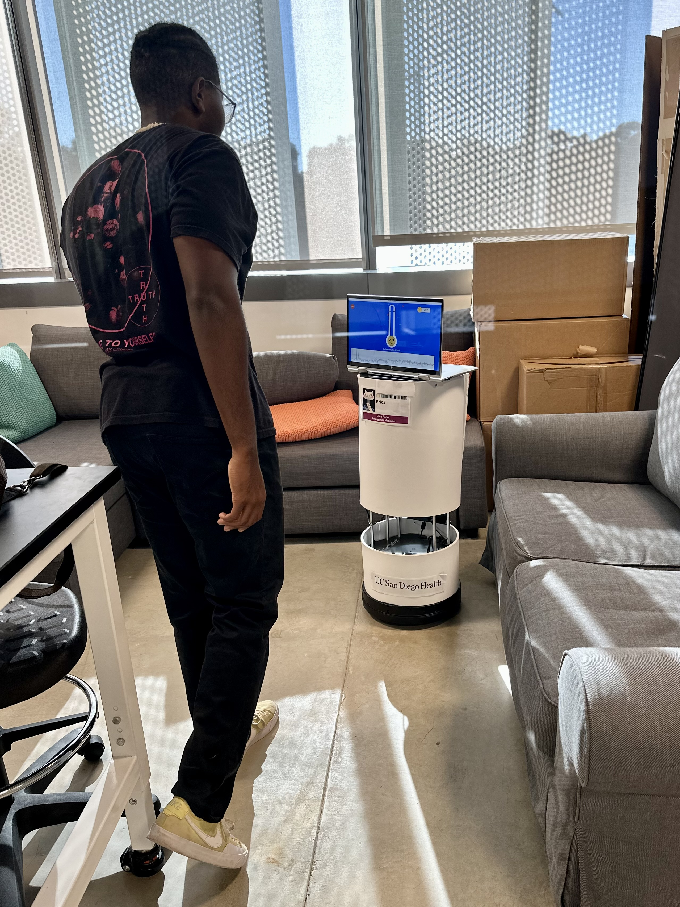

For details on this project and more context, please read our [HRI 2024 paper](https://cseweb.ucsd.edu/~lriek/papers/bestmann-HRI24.pdf). 

We ask that you cite our paper if you use this repository - thanks! 

<code>Benjamin O. Bestmann, Alex Chow, Alyssa Kubota, and Laurel D. Riek. 2024. GARRY: The Gait Rehabilitation Robotic System. In Proceedings of the 2024 ACM/IEEE International Conference on Human-Robot Interaction (HRI ’24), March 11–14, 2024, Boulder, CO, USA. ACM, New York, NY, USA, 5 pages. https://doi.org/10.1145/3610977.3637475
</code>

**Table of Contents:**

- [GARRY Project 🚶‍♂️🧠🤖](#garry-project-️)
  - [Introduction:](#introduction)
    - [Application Diagram](#application-diagram)
  - [Installation](#installation)
    - [Prerequisites](#prerequisites)
      - [Hardware](#hardware)
      - [Software](#software)
    - [Code and Tools Installation](#code-and-tools-installation)
      - [Python Flask Server](#python-flask-server)
      - [MATLAB](#matlab)
      - [Flutter](#flutter)
      - [VS Code extensions](#vs-code-extensions)
      - [ROS/Turtlebot](#rosturtlebot)
  - [Getting Started](#getting-started)
    - [Python Flask Server](#python-flask-server-1)
    - [Flutter](#flutter-1)
    - [ROS/Turtlebot](#rosturtlebot-1)
    - [MATLAB](#matlab-1)
  - [Usage](#usage)
      - [Flutter](#flutter-2)
        - [Application Structure Overview](#application-structure-overview)
        - [Main Page](#main-page)
        - [Sessions Page](#sessions-page)
        - [Selection Page](#selection-page)
        - [Sample Feedback Session](#sample-feedback-session)
        - [Summary Page](#summary-page)
      - [MATLAB](#matlab-2)
      - [ROS](#ros)
    - [Future Additions](#future-additions)

## Introduction:
Welcome to the GARRY project, developed by the UCSD Healthcare Robotics lab. 
Our project aims to improve motor rehabilitation outcomes for patients with 
post-stroke hemiparesis by providing a novel robot-based gait training system.

This project is a Flutter application.

A few resources to get you started if this is your first Flutter project:

- [Lab: Write your first Flutter app](https://flutter.dev/docs/get-started/codelab)
- [Cookbook: Useful Flutter samples](https://flutter.dev/docs/cookbook)

For general help, we suggest looking at the 
[online documentation](https://flutter.dev/docs), which offers tutorials,
samples, guidance on mobile development, and a full API reference.

### Application Diagram ###
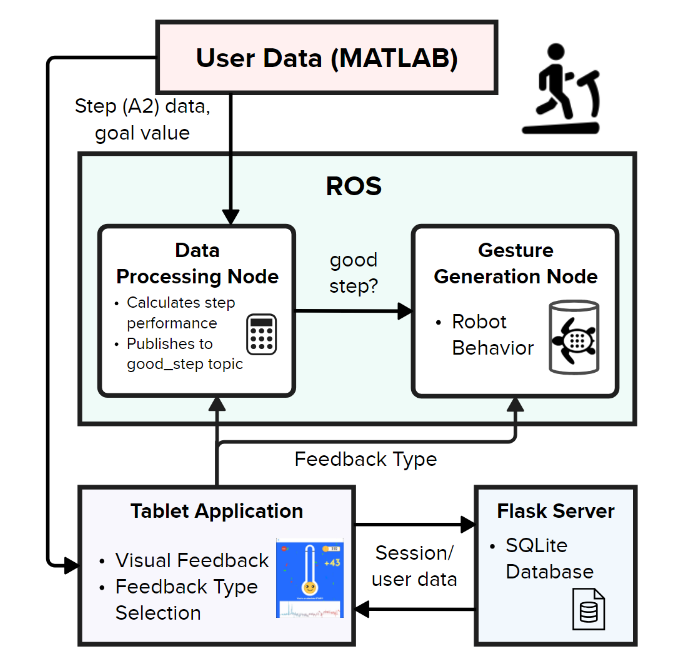

The data collected from participants by UC Davis researchers consists of numeric measurements of angle, 
frequency, and power generated by the body using concentric muscle activity (iA2). 
This is used to characterize the full gait cycle of a leg from heel strike 
(to start the step) to heel strike (to end it).

To envision the motion capture process and early feedback design here is an early visualization (click the screenshot below to watch the demo video):

In the video, the participant is in the positive feedback mode. For every step they take, the plus will light up if they reach their performance goal. If not, it will not light up.

Our app takes a similar approach. As the participant proceeds in the rehabilitation session, their data is downloaded and streamed into our app where they can view their session progress in real-time. They are also given different kinds of animated feedback on the quality of their step in relation to the predetermined goal metrics.

This data is collected by UC Davis researchers and sent to us for use in the system. They work with people recovering from stroke, which serves as the basis of the work. Our
application uses this data to provide personalized gait training and real-time 
feedback to people during the rehabilitation process. 

We developed the application using Android Studio ver 1.0.0+1 and Visual Studio ver 17.5 on 
Windows 10/11, and used Google Chrome ver 110.0.5481.178 and the Google Nexus 7 
display to emulate the program.

To set up the GARRY project on your Windows 10 laptop, please follow the steps below:
## Installation
### Prerequisites
#### Hardware
- A Windows 10 or 11 computer/laptop
- Turtlebot 2
- An Ubuntu version 18.04 laptop/computer connected to the Turtlebot 2, running ROS Melodic

#### Software
This system can be set up with multiple devices as long as all are on the same network.

On a Windows laptop/computer:
- MATLAB R2023a
- Python >=3.8.10
    - Flask
    - flask-cors
- Visual Studio Code (VS Code)
    - Extensions:
        - Flutter >= 3.74.0
        - Dart >= 3.74.0
- Flutter SDK >= 3.7.12
- Dart SDK >= 2.19.6 (comes with Flutter SDK)

On the Ubuntu laptop/computer:
- Python 2.7

<!-- * Install Android Studio V 1.0.0+1 and Visual Studio V 17.5 on your device.
* Clone the GARRY-Flutter repository to your local device.
* Open the GARRY project in Android Studio and build the application from the GARRY-Flutter folder.
* In the Flutter Device Selection menu in the top, center-left, choose your simulation device (Web browsers preferred as Virtual emulators tend to lack storage space).
* Get needed dependencies
* Ensure you are up to date with the main branch by calling a Git pull request -->

### Code and Tools Installation

#### Python Flask Server
The folder "GARRY-Server" should be placed on the Windows computer/laptop.
1. Install any Python version greater than or equal to 3.8.10.
2. Open a terminal, navigate to our GARRY-Server directory, and run `pip install -r requirements.txt` to install Flask and flask-cors dependencies.

#### MATLAB
For our MATLAB server, we utilized [jebej's MatlabWebSocket library](https://github.com/jebej/MatlabWebSocket). The folder "GARRY-MatlabWebsocket" should be placed on the Windows computer/laptop. Follow the below steps to set up.

1. There is "jar" subfolder inside the "GARRY-MatlabWebsocket" folder. Locate "matlab-websocket-1.6.jar" inside the "jar" folder and save the path to that jar file.
2. In the MATLAB command window, run `edit(fullfile(prefdir,'javaclasspath.txt'))`. If it tells you that the file does not exist and asks you if you want to create it, click "Yes".
3. This should open up the code editor for `javaclasspath.txt`. In the text file, type in the path to the jar file you located in step 1 (pure path, without quotes or anything). For example, if your jar file path is `C:\MatlabWebSocket\jar\matlab-websocket-1.6.jar`, then write that in the text file.
4. Save the file and restart MATLAB.
5. In the command window, type in `javaclasspath` and verify that the path to your jar file is listed.
6. At the top of MATLAB, go to Home -> Environment -> Set Path.
7. Click on "Add Folder" and add the `src` subfolder under the "GARRY-MatlabWebsocket" folder. Then click "Save". If it asks you if you want to save it to another location, hit "Yes". Lastly, hit "Close".
8. Run `server = GarryMatlabServer(4000)` and verify that there are no errors. If this does not work, restart MATLAB and try again.
9. If you wish to stop the server at any point, type in `server.stop`. More commands can be found in jebej's GitHub repo as linked above.

#### Flutter
The folder "GARRY-Flutter" should be placed on the Windows computer/laptop.
1. Download the Flutter SDK any version >= 3.7.12 from [here](https://urldefense.com/v3/__https://docs.flutter.dev/release/archive?tab=windows__;!!Mih3wA!FPQOotNdzvKmibdlCGmC0sRnAx04wmr_9Q5h-U32R1s7nbmaKpWulAA1Tk9utBAhqtewc5KVmnAE2W3g$ ) (under the Stable Channel scroll list). You can simply click on the version number itself in the first column. It will likely be a zip file.
2. Once downloaded, move it to a folder where you can find it easily.
3. Extract the zip into a folder, and ensure that it has a subfolder inside named `flutter`. Note where this subfolder is located; you will need to know this path when setting up VS Code below.

#### VS Code/extensions
The VS Code editor we discuss here will refer to installation on the Windows laptop/computer. You can download VS Code here. TODO
1. Install the Flutter and Dart extensions in VS Code.
2. Open up the "GARRY-Flutter" folder.
3. If prompted, hit "Locate SDK" and locate the `bin` subfolder under Flutter SDK/folder you downloaded and extracted.
4. If prompted, "Run `pub get`".

#### ROS/Turtlebot/Ubuntu
The following instructions are for the Turtlebot/robot that uses ROS, or a laptop/computer connected to one.
1. Move our `GARRY-ROS` into the `src` subfolder in your catkin workspace (most commonly, this is known as `catkin_ws`).
2. Run `cd ..` back to your root `catkin_ws` directory and run `catkin_make`.
3. Next, run `source ~/catkin_ws/devel/setup.bash`.
4. Run `echo $ROS_HOSTNAME` and ensure it's `localhost`. If not, write down the original value for backup and run `export ROS_HOSTNAME=localhost`.
5. Run `echo $ROS_MASTER_URI` and ensure it's `http://localhost:11311`. If not, write down the original value for backup and run `export ROS_HOSTNAME=http://localhost:11311`.

You can now get started looking through the code!

## Getting Started
**IMPORTANT:** Before getting started, please make sure that all devices are on the same network. We will be using `localhost`.

### Python Flask Server
Our Flask server uses the port 5000.
1. Open a terminal and navigate to the GARRY-Server folder.
2. Run `python -m flask run -p 5000` to begin the flask server.

### Flutter
1. In VS Code, open the folder "GARRY-Flutter"
2. On the bottom right of VS Code there will be text saying "Chrome(web-javascript)" or "Edge(web-javascript)". You can choose which device or platform you want to run it on.

### ROS/Turtlebot
1. Turn on your Turtlebot.
2. On the laptop connected to the Turtlebot, open a terminal.
3. Run `source ~/{your catkin workspace name}/devel/setup.bash`, replacing '{your catkin workspace name}' (it will most likely be `catkin_ws`.
4. Run `ifconfig` and take note of the IP address of the network the device is on.
5. Run `roscore`.
6. In another terminal, navigate to the `garry_ros` package folder by running `roscd garry_ros`.
7. Run `startup.py` to both bring up the Turtlebot and to get it set up with the GARRY system.

### MATLAB
1. In the command window, run `server = TestServer(4000)`.
  

## Usage 
The following breaks down the important elements necessary to use each aspect of our system.

#### GARRY-Flutter

Currently, the data we have been using for simulation has come from a shared MS drive with UC Davis
(ask for permission for access), so you must currently **download** the data you would like to work with
and put it in your **assets** folder.

##### Application Structure Overview #####

The `api` repository contains:
* `api.dart`: All API calls to the GARRY-Server in order to retrieve and update sessions and participant data.
In the future, we plan to separate this into two files: `sessions_api.dart` and `participants_api.dart`.

The `backend` repository contains:
* `score_entry.dart`: A PODO (plain old Dart object) for each score entry on the scoreboard, containing the date (string) and the score (int).
* `scoreboard.dart`: The self-containing, animated, scrollable widget that displays session scores in descending order.

The `components` repository contains front end widgets:
* `buttons.dart`: The TextButton widget and its style.
* `confettiColors.dart`: The set colors of the confetti associated with regular and Binary confetti controllers, differing by color selection.
* `navigation.dart`: A Cupertino Navigation Bar and the nextPageButton Widget along with their styles
* `progress_chart.dart`: The Progress Chart widget that creates the line chart during each session. Contains its height (double), dataPoints (FLSpot), colors (Color), and threshold Line (FLSpot)
* `score_card.dart`: The ScoreCard class that contains its key, rank, date, score, newIndex, reportHeight and animations
* `selection_menu.dart`: The SelectionMenu widget which contains its text, slectionIndex and style, and the SelectionMenuOption class which contains its index, fontSize, text and other components
* `sessions_table.dart`: The globalData Map (dictionary in Python), that gets filled & sent out with each new session
* `text_labels.dart`: The particiapntIDLabel which shows the participants ID

The `constants` repository contains:
* `enums.dart`: The list of feedback types in use for the application
* `strings.dart`: The string form of the path to the assets folder

The `Feedback_widgets` repository contains:
* `Binary_widgets.dart`: A group of widgets that provide the basis of the session page for Explicit Feedback. Contains the progressBar, coin display, pointDisplay, percentageDisplay, endSessionButton, textFeedback and pointsFeedback widgets that appear on those pages.
* `Positive_widgets.dart`: The same as `Binary_widgets.dart` but also includes the confetti widgets and is used for Positive, Negative, and Binary feedback pages.

The `globals` repository contains:
* `global_states`: The network congifhurations (locations of the SQL server address and the Websocket server address)

The `providers` repository contains:
* `user_model.dart`: A UserModel provider that extends a ChangeNotifier, contains the setPID and setName functions, and allows the properties of a user to be carried between pages and referenced globally within the app. 

The `ui` repository contains:
* `dimensions.dart`: Contains enums (fixed set of named values) for the different feedback page components, set values for the dimensions of each of those pages and a computeSize variable to calculate the remaining dimensions needed

The `utils` repository contains:
* `ease_out_back_scaled.dart`: The EaseOutBackScaled class which sets the scale for transforms that are used on various pages

The `widgets\feedback page` repository contains:
* `base_feedback_page.dart`: An abstracted base version of every feedback page which can be extended to cater to each specific feedback type.
* `feedback_page_component.dart`: Contains the different methods and widgets necessary to build the feedback page.
* `file_selection_page.dart`: Contains the file selection page that contains the mock data we test with. 

The rest of the dart pages like `Positive_Feedback.dart` will be described below.

##### Main Page #####

  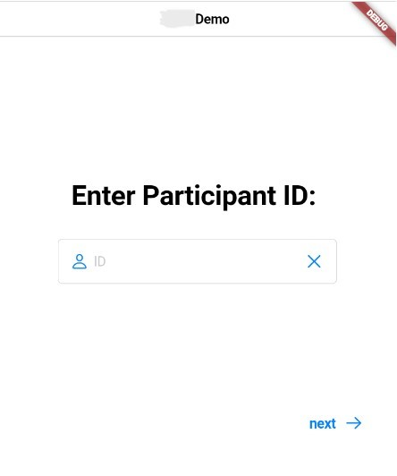

The app begins at the main landing page, because we are using flutter, every 
page is itself a widget and can be constructed with a lot of customizable 
aspects. Ours consists of a title at the top and a textfield that allows the 
patient to enter their ID and progress into the app by clicking the **“next”** 
button on the bottom right. The textfield saves the input ID and forwards it to 
the next page.

If the id provided is not available in the database, the user is prompted to create
and entry for that id. With this popup appearing:

  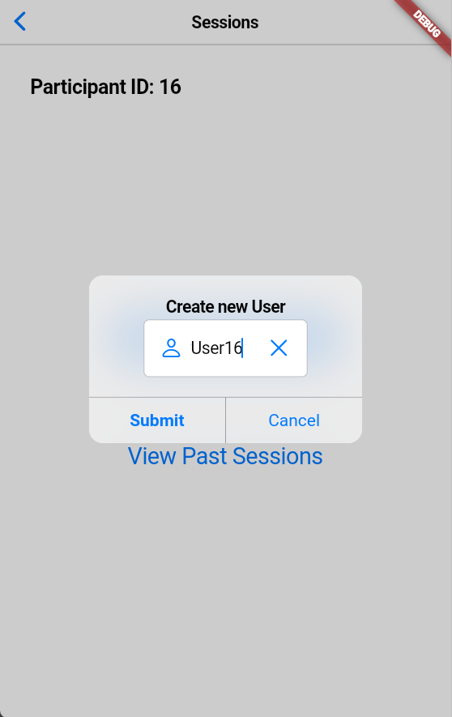

The class myApp is the main app for this page, but within it, we return a 
CupertinoApp and set it's home variable to a custom stateless widget. This 
statless widget contains a build method that forms the basis of the page. At 
override (when the page launches) the page is built with flexible dimensions, 
a navigation bar and a stack of widgets with sized boxes and a Text Field. This 
field has a controller which clears the field when the 'X' is pressed. When the 
**"next"** button is clicked the navigator pushes the participant ID to the next 
page.

##### Sessions Page #####

  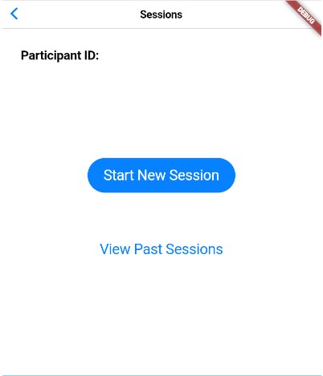

This leads the user to the Session page, named in the appbar, which gives the 
user the option to start a new session or view previous sessions. The **“Start New Session”** 
button sends the user to a new page where they can pick the type of 
session they want to commence with. 

This page recieves the data from the TextController in the main page and uses it
to build itself. The **“Start New Session”** button is a custom widget derived from
a CupertinoButton that has a navigator attached that pushes the user to the next
page. 

  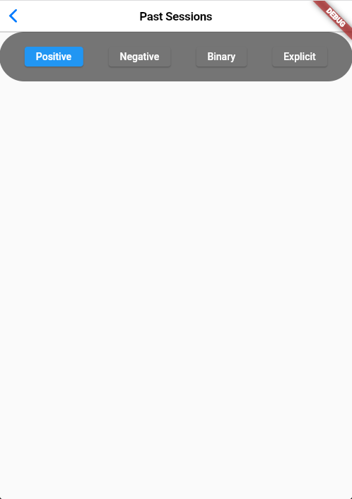

The **“View previous sessions”** button sends users to a page that 
includes the information stored from each of their previous sessions, separated
by feedback type presented in card form. The base page only contains the bar that
allows you to specify feedback type.

  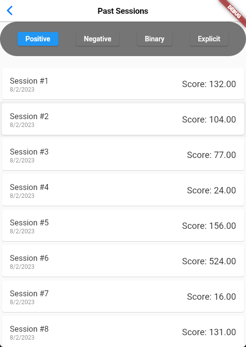

By clicking on any of the feedback types in the bar, a list of cards is built drawing
directly from the database with each card having some important details from its 
corresponding session.

  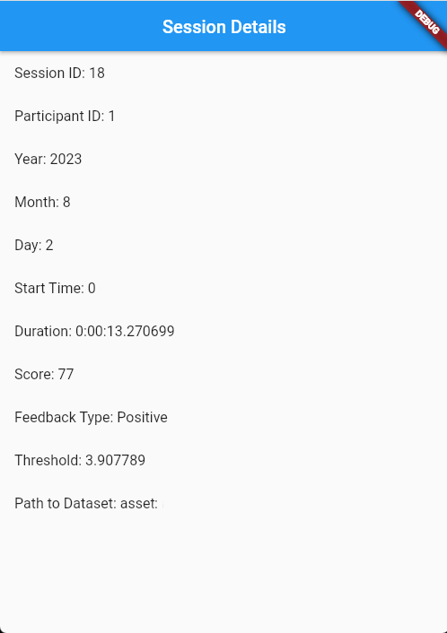

Clicking on any of these cards will open up a new page with all the information from the session.

##### Selection Page #####

  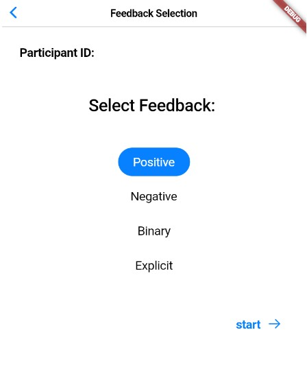

On the Selection page, the user gets a choice of which type of session they want
to participate in with each different session listed in a custom widget designed
to log the user’s choice so when the “next” button at the bottom right is
clicked, the user is sent to the page of the relevant session. In the future, it
might make sense to store the session type at this point so it can be sent to
the session database.

Currently, each dataset contains a threshold value that patients are aiming to 
acheive with each step, after the goal iA2 value (the threshold value) is 
isolated, each value in the iA2 and step/stride count sections is converted into
a future value which can be streamed into the custom widgets on the page and 
used to make a visual representation of the patient’s progress. 

Depending on the choice of session, the user is sent to the relevant starting 
page where the session can begin in earnest and they can see multiple 
representations of their progress: 

##### Sample Feedback Session #####

  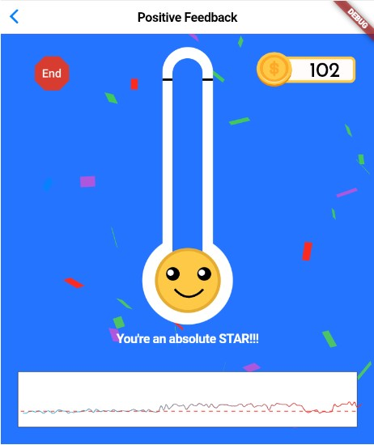

The custom thermometer widget which converts the future values into percentages 
which are displayed as the height of the liquid in the thermometer, a space 
where text feedback is displayed based on the value of the current converted 
iA2, and the continuous linechart at the bottom of the page which displays each
future on the chart with a horizontal indicator at the goal value 
(A perfect 100% step) for the entire session. There is also point counter at the
top right of the screen that displays scores based on the feedback parameters.

##### Summary Page #####

  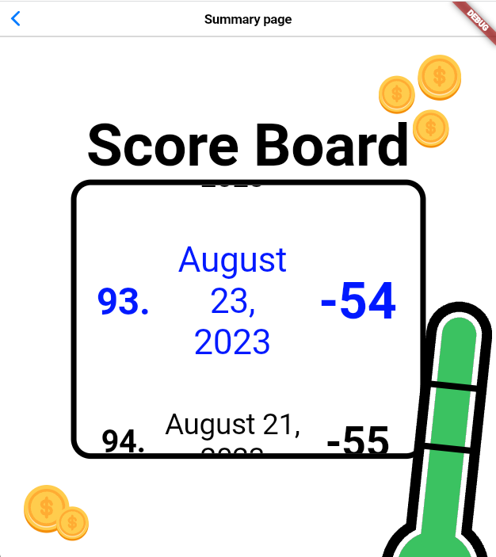

Finally, after a session has been completed, the user can choose to end the 
session and be directed to a summary page which displays the accrued points from
that session in comparison with the other scores from that pid and ranks them on 
a leaderboard setup.

#### MATLAB

As the raw data is currently being collected by UC Davis via MATLAB, we used websockets to directly send that data locally from the MATLAB IDE to the application
 
<!-- The current version of the app uses a websocket that streams the data from collection into the app. In the current setup, when a dataset is chosen in app, it sends a unique signal to the websocket and in turn it builds the session using the data from the corresponding dataset. This system will be further configured to live data. -->

GARRY utilizes MATLAB to process raw sensor data in real-time and simulate sessions for testing. The MATLAB code sends real-time, correctly formatted data from users to both our tablet application and the robot via websockets.

Our implementation streams preexisting session data provided by our clinical collaborators into the app and the robot. This data is easily replaceable with real-time data received from sensors.
To understand how we built a websocket server inside MATLAB to send the data see [the MatlabWebsocket documentation here.](https://github.com/UCSD-RHC-Lab/M3X-MatlabWebsocket)

Currently, once the researcher starts a session through the app, it sends a message to the MATLAB program to signal that the session is starting. 

Matlab then begins streaming the user's step data and threshold to the app, which updates and animates the screen based on the user’s performance.

The Matlab Websocket also sends data to the ROS Nodes we integrated into our system.

#### ROS

Our ROS section of the code was implemented to have greater control of the robot's actions in relation to a user's performance during a session. To this end, our ROS system receives data from our Matlab websocket through specific topics, translates that data into the right format, and moves the robot accordingly.

Matlab's connection with the ROS nodes is faciliatated through topics.

The `/data` topic receives the users step data and goal value for the session and returns that data.

The `/feedback_type` topic receives the chosen feedback mode of the session and returns that data.

The `/good_step` topic receives the average proportional A2 values over a period of time and returns a boolean value representing whether a good step has been achieved in that period.

 Our ROS system is characterized by 2 nodes:
* `The Data Processing Node (DPN)`: Subscribes to `/feedback_type` and `/data` topics, determines if
the user has taken a “good step” from the A2 and goal values, and sends the result to the `/good_step` topic.

* `The Gesture Generation Node (GGN)`: Subscribes to the `/feedback_type` and `/good_step` topics to direct robot movement. If the robot receives a “true” message from `/good_step` and that period of time has passed since the start of the last gesture, it will perform a new gesture.

This system allows us to take the A2 and goals data generated from the Matlab section and ensure whatever robot compoenent of our system can utilize the data and respond appropriately.

### Future Additions ###

- We aim to streamline the application and include some more functionality for 
doctors or whoever would run each session, such as: 
    - The ability to change the threshold value midsession 
    - The ability to change the type of the linechart from discrete 
points to continuous
    - The ability to monitor changes/trends between multiple sessions.
